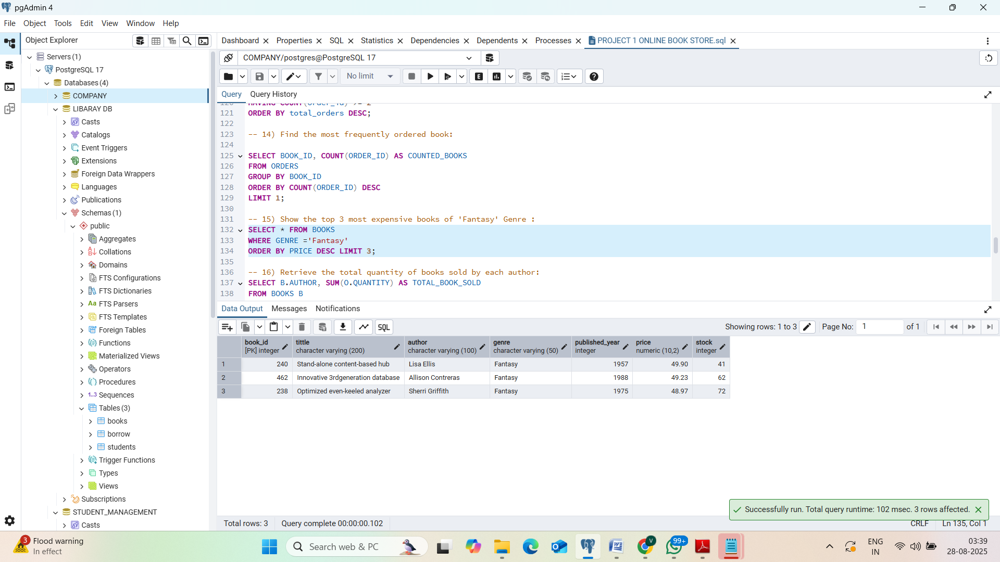
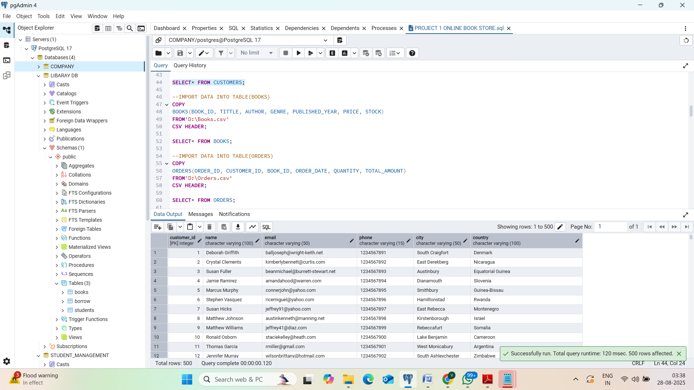

📚 Online Bookstore SQL Project

📖 Project Overview
This project demonstrates the design and implementation of a relational database for an **Online Bookstore** using **PostgreSQL**.  
It covers database schema creation, importing CSV data, and running advanced SQL queries to generate insights.

🛠️ Features

* Customers, Books, and Orders tables
* Data import using CSV
* 15+ SQL queries for insights:

  * Most expensive book
  * Total revenue
  * Customers with multiple orders
  * Most sold genres, etc.

🧾 Example Queries

-- Find the most expensive book
SELECT \* FROM BOOKS
ORDER BY PRICE DESC
LIMIT 1;

📷 Query Output Examples

**1. Top 3 Most Expensive Books of Fantasy Genre**

**2. Customers Table Output**

